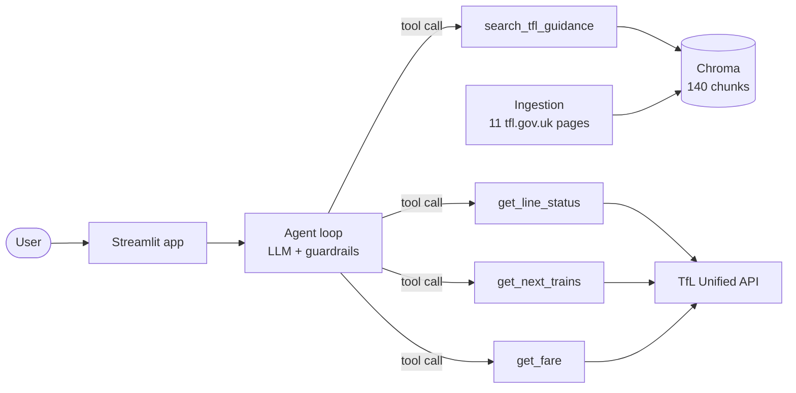

# London Tube Assistant

[](https://github.com/NafisaIslamRifa/london-tube-assistant/actions/workflows/ci.yml)

**An agentic RAG assistant for London transport: live line status, next trains and fares from the TfL API, plus cited answers from official TfL guidance.**

**[Live demo](https://london-tube-assistant.streamlit.app/)** · LLM tool calling · RAG with Chroma · Streamlit · Docker · GitHub Actions


> Unofficial portfolio project, not affiliated with TfL. Powered by TfL Open Data.

---

## What it does

| Ask | What happens |
|---|---|
| "Is the Victoria line running?" | Calls the live **line status** tool and reports the time of the data |
| "How much is Bank to King's Cross?" | Resolves both stations (typos are fine) and calls the live **fare** tool |
| "When is the next train at Oxford Circus?" | Calls the live **arrivals** tool |
| "Do I need to touch out on the bus?" | **Searches TfL guidance** and answers only from it, with a link to the page |
| "How much is Bank to Victoria, and is the Central line OK?" | Calls **two tools** in one turn and combines the results |
| "What's the best restaurant in Soho?" | Politely declines: out of scope |

The app also has a live status board, a fare finder and a next-trains view.

## Architecture



**How one answer is produced**
1. The **agent** sends the question, the current London time and four tool descriptions to the LLM.
2. The LLM chooses tools; the agent runs them and returns compact JSON results (several tools per turn are allowed).
3. Guidance answers come only from retrieved TfL passages; live answers come only from the API.
4. **Guardrails in code** check every link in the answer against the tool results, and cap the loop at 5 steps and 2 searches per question.

## Evaluation

All numbers below are written into this file by `python -m tube.evaluation.update_readme` from the saved results, so they can be reproduced.

### Retrieval: does search find the right TfL section? (`python -m tube.evaluation.retrieval_eval`)

<!-- retrieval-eval:start -->
Measured on 32 everyday-language questions, each mapped to the TfL page and section that answers it (2026-10-07).

| Search | Right page first | Right page in top 5 | **Right section first** | Right section in top 3 | Section MRR |
|---|---|---|---|---|---|
| vector only | 0.94 | 1.00 | 0.81 | 0.97 | 0.88 |
| vector + rerank | 0.88 | 1.00 | 0.78 | 0.97 | 0.87 |
<!-- retrieval-eval:end -->

**Decision:** a cross-encoder reranker (ms-marco-MiniLM-L-6-v2) was added and measured. It fixed 3 questions and broke 3 others, a small net loss, while adding a second model and extra latency. Vector search is therefore the default; reranking is one setting away (`USE_RERANK=true`).

### Agent: end to end, with real LLM and TfL calls (`python -m tube.evaluation.agent_eval`)

<!-- agent-eval:start -->
Model: `openai/gpt-oss-120b via groq` · run 2026-10-07 · 0 errors.

| Metric | Result |
|---|---|
| Questions passing every check | 13 / 18 |
| Tool selection accuracy | 1.00 |
| Citation accuracy (expected TfL page linked) | 0.62 |
| Live answers that state the data's time | 1.00 |
| Unknown station handled without inventing a fare | 1.00 |
| Invented-link rate | 0.17 |
| Median time per question | 31.6 s |
| Average tokens per question | 2571 |
<!-- agent-eval:end -->

The 18 questions cover guidance, each live tool, multi-tool questions, an unknown station and off-topic requests. Live answers change, so checks are structural: right tools, the expected page linked, a timestamp on live data, no invented price or link.

### What evaluation caught along the way
- **Wrong page list:** the first fetch showed 2 of 9 TfL pages had moved (404). They were replaced with real paths found by a link-discovery script.
- **Wrong test questions:** section-level accuracy was stuck at 0.64. Inspecting the failures showed several questions expected section headings that TfL's pages no longer have. Rewriting the questions against the real headings gave trustworthy numbers.
- **Scraping blocked in the cloud:** tfl.gov.uk refused requests from the hosting provider. The app degraded gracefully (live tools kept working) and now ships a dated snapshot of the pages instead.

## Engineering

| Area | Choice |
|---|---|
| LLM | Any OpenAI-compatible API, chosen in `.env`: Groq (`gpt-oss-120b`, free tier) by default, a local **Ollama** model, or OpenAI. Client-side pacing and retries honour free-tier rate limits. |
| Retrieval | Section-aware chunking (a chunk never crosses a heading), `bge-small-en-v1.5` via fastembed (ONNX, no PyTorch), Chroma with cosine similarity |
| Live data | TfL Unified API client with retries; a station directory built from TfL's own data, with typo-tolerant matching ("picadilly circus", "kings cross") |
| Conversation | Follow-ups work; finished tool results are dropped from history to stay within small token budgets |
| Tests | 90+ offline unit tests: scripted fake LLM, canned TfL replies, Streamlit `AppTest` for the UI |
| Ops | Docker image (non-root, health check, model baked in), Compose with an optional Ollama container, CI runs tests then builds and health-checks the image |

## Run it

### Python
```bash
pip install -r requirements.txt
cp .env.example .env                       # add LLM_API_KEY (free at console.groq.com)
python -m tube.bootstrap                   # station list + search index
python -m tube.agent.cli "Is the Victoria line running?"
python -m streamlit run app/streamlit_app.py
```

### Docker
```bash
docker compose up --build                  # http://localhost:8501
```

| Setup | Command |
|---|---|
| Hosted LLM (Groq), default | `docker compose up --build` |
| Fully local LLM, no key (Ollama + llama3.2, ~2 GB) | `docker compose -f docker-compose.yml -f docker-compose.ollama.yml up --build` |
| GitHub Codespaces (container networking workaround) | `docker compose -f docker-compose.yml -f docker-compose.host.yml up --build` |

### Free public demo (Streamlit Community Cloud)
App file `app/streamlit_app.py`, Python 3.12, and these Secrets:
```toml
LLM_PROVIDER = "groq"
LLM_API_KEY = "your-groq-key"
LLM_RPM = "4"
DEMO_MAX_QUESTIONS = "5"
```

### Useful commands
```bash
python -m pytest -q                                   # unit tests (no network, no keys)
python -m tube.ingest.fetch_tfl                       # refresh the TfL guidance snapshot
python -m tube.rag.search --compare "touch out bus"   # vector vs reranked results
python -m tube.evaluation.retrieval_eval              # retrieval metrics
python -m tube.evaluation.agent_eval                  # agent metrics (uses the LLM)
python -m tube.evaluation.update_readme               # write results into this README
```

## Project structure
```text
tube/tfl/         TfL API client, line status, arrivals, fares, station directory
tube/ingest/      download and clean TfL guidance pages (section-aware)
tube/rag/         chunking, embeddings, Chroma store, search (+ optional reranker)
tube/agent/       LLM client, tools, prompt, guardrails, agent loop, CLI
tube/evaluation/  retrieval and agent evaluations, README updater
app/              Streamlit UI
eval/             evaluation questions and saved results
tests/            unit and UI tests
```

## Limitations and next steps
- Guidance covers 11 TfL pages (paying, fares, discounts, Night Tube, accessibility). Next: buses, Overground and journey planning.
- The guidance snapshot is dated; re-run `fetch_tfl` to refresh it (a scheduled GitHub Action could automate this).
- Small evaluation sets (32 retrieval and 18 agent questions); more paraphrases and adversarial questions would make the numbers firmer.

## Data and licences
- Live data: TfL Unified API, *Powered by TfL Open Data* (contains OS data © Crown copyright and database rights).
- Guidance excerpts are short extracts from tfl.gov.uk, linked to their source pages.
